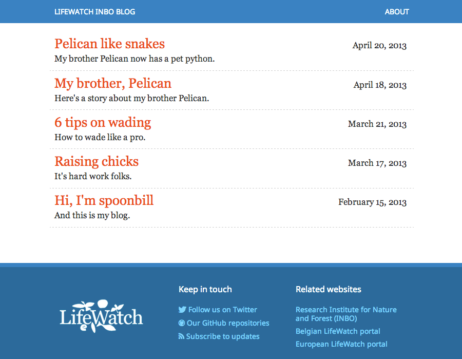

# Spoonbill

## Introduction

Spoonbill is a theme for [Pelican](http://docs.getpelican.com/) powered blogs. I use it for [my own blog](http://peterdesmet.com) and it was inspired by [Zach Holman](http://zachholman.com/)'s blog.

## Installation

These instructions assume you have completed the [Getting Started](http://docs.getpelican.com/en/latest/getting_started.html) guide and have a working Pelican site.

1. Clone or download the Spoonbill theme and move it to the directory of your choice, e.g. `~/my-themes/spoonbill`.
2. Generate your site from the command line, with the `-t` option for themes. For example:

		pelican ~/my-site/content -s ~/my-site/content/settings.py -t ~/my-themes/spoonbill

3. Your spoonbilled site is now available in the output directory.
4. If you like it, add a link to the Spoonbill directory in your Pelican settings file, so you won't need to specify the theme each time you generate the site. For example:

		THEME = "~/my-themes/spoonbill"

For more options, see the [Pelican documentation regarding theme settings](http://docs.getpelican.com/en/latest/settings.html#themes).

## Settings

Spoonbill has some custom Pelican setting identifiers. Don't forget to include them in your [settings file](http://docs.getpelican.com/en/latest/settings.html).

	SITEDESCRIPTION = "Site description for in description meta tag"
	GOOGLE_WEBMASTER = "Google Webmasters Tools verification code"
	TWITTER_URL = "URL to your Twitter account (used in footer)"

## Dependencies

* [Pelican](http://docs.getpelican.com/), a static site generator written in [Python](http://www.python.org/).
* [Open Sans](http://www.google.com/fonts/specimen/Open+Sans) font (normal & **bold**) for body text (served via Google Fonts).
* [Quicksand](http://www.google.com/fonts/specimen/Quicksand) font for header text (served via Google Fonts).
* [Font Awesome](http://fortawesome.github.io/Font-Awesome/) for icons (included).
* [normalize.css](https://github.com/necolas/normalize.css) for CSS resets (included).
* [modernizr-2.6.2.min.js](http://modernizr.com/) for browser support detection (included).

Spoonbill is based on [html5boilerplate](http://html5boilerplate.com/). The following default files are included, but not activated: `js/main.js`, `js/plugins.js`, `js/vendor/jquery-1.9.1.min.js` (see at the end of [base.html](templates/base.html)).

## Known issues

Translations are not supported.

## Alternatives

There are a whole bunch of [Pelican themes available on GitHub](https://github.com/getpelican/pelican-themes).

## How to contribute

Feel free to [fork this repo](https://help.github.com/articles/fork-a-repo). If you want to contribute something back, [send a pull request](https://help.github.com/articles/using-pull-requests). I'm always happy to [get feedback](https://twitter.com/peterdesmet).